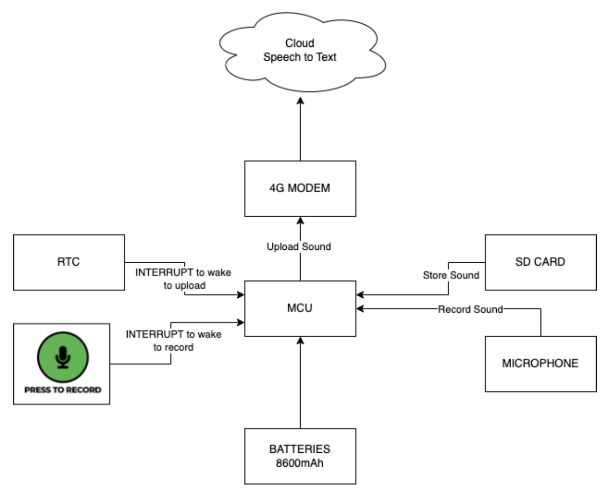
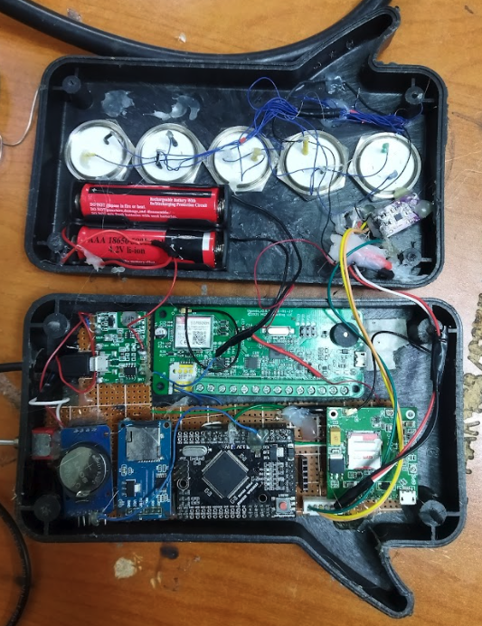
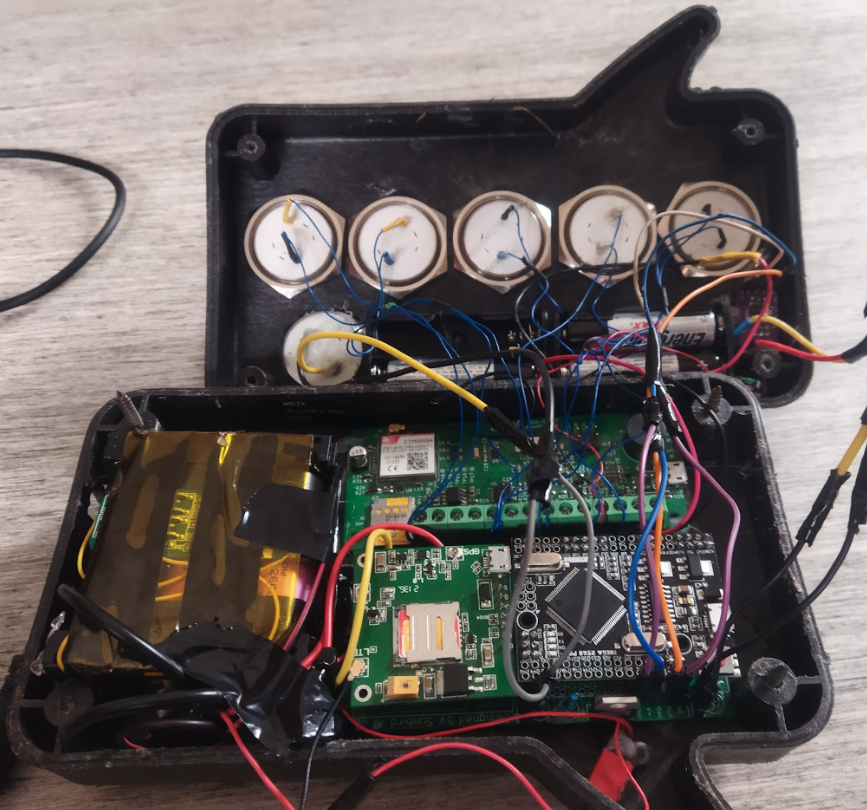
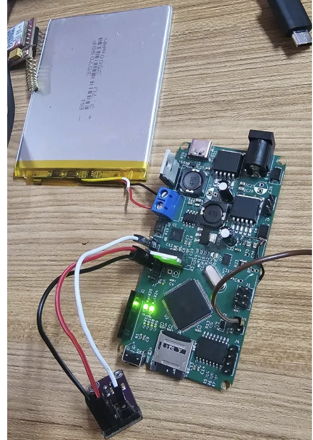
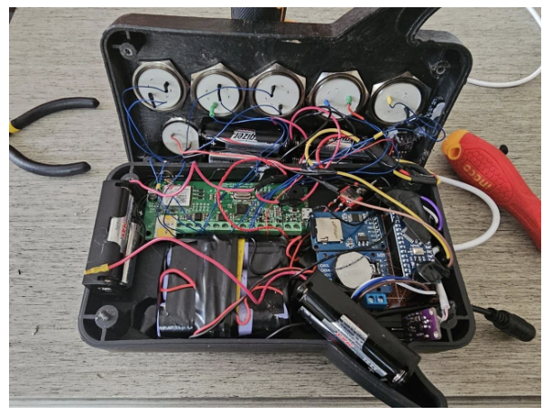
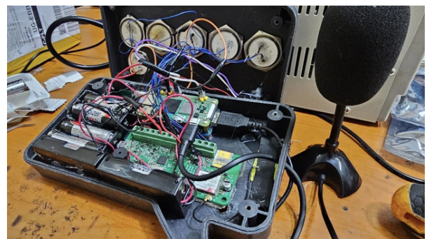
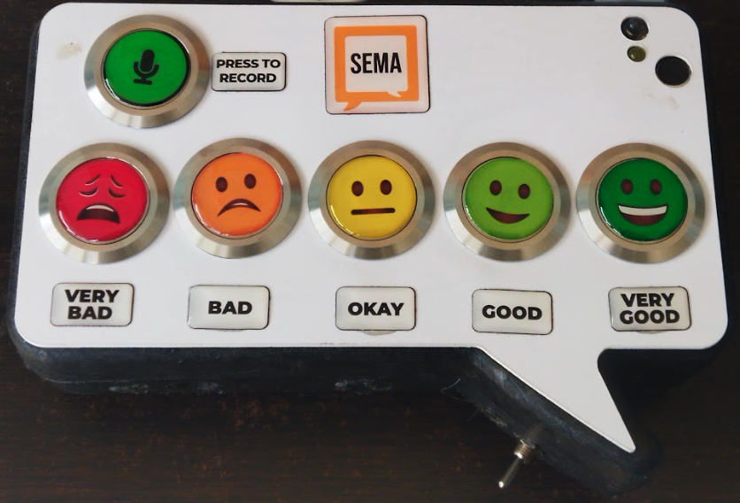

## Firmware and Software Overview

**Repository:** `Sbgeneration1audiofeedback`

This section documents the firmware implementation for the first-generation voice feedback device, as maintained in the project GitHub repository.

---

### Core Libraries Used

- **TinyGSM** – LTE modem communication  
- **SPI** – Peripheral communication interface  
- **SD** – Local SD card storage  
- **TMRPCM** – Audio recording and playback in WAV format  
- **EEPROM** – Persistent storage of counters and device state  
- **ARDUINO-TIMER** – Task scheduling and low-power timing  

---

### Device Operation Logic

1. Device remains in low-power sleep mode by default  
2. User presses button → device wakes up  
3. Records a voice feedback audio file (`.wav`)  
4. Stores file on SD card  
5. Increments file counter  
6. When 5 files are recorded:  
   - LTE modem activates  
   - All 5 files are uploaded to the citizen feedback portal  
   - Counter resets to 1  
7. Device returns to sleep mode

*Figure: Sema Audio Feedback Device Architecture*

# Sema Audio Feedback Device Versioning and Comparison

This document summarizes the evolution of the **Sema Audio Feedback Devices** across four major iterations. It highlights the hardware choices, functional improvements, power performance, and deployment considerations to support decision‑making on which device version is best suited for specific field deployments.

---
## Objective
To provide a clear comparison of Sema device versions developed over time, showing technological progress, feature improvements, and deployment trade‑offs for supervisors and project stakeholders.

---
## Device Version Summaries

### **Device Version 1.0 – Initial Prototype**
**Purpose:** First proof‑of‑concept for collecting citizen audio feedback and transmitting to the portal.

**Key Features**
- Main controller: Arduino Mega Pro Mini
- Audio format: WAV recording
- Transmission: LTE modem upload to citizen feedback portal
- Maximum audio length: 15 seconds
- Power: 2 lithium batteries (series or parallel configuration)
- Runtime: ~2 days
- Audio quality: Raw microphone input, no background noise suppression

**Pros**
- Functional end‑to‑end audio capture and upload
- Simple and low-cost design

**Cons**
- Short battery life
- Limited recording duration
- No noise suppression

*Figure: Sema Audio Feedback Device Version 1.0*

---

### **Device Version 1.2 – Enhanced Audio Quality and Runtime**
**Purpose:** Improved upon v1.0 with longer recording and better audio clarity.

**Key Features**
- Main controller: Arduino Mega Pro Mini
- Audio format: WAV recording
- Transmission: LTE modem upload to citizen feedback portal
- Maximum audio length: Up to 1 minute (can stop early when user finishes)
- Microphone: Noise‑cancellation microphone
- Power: 3 lithium batteries in series
- Runtime: ~7 days
- Audio quality: Improved with background noise suppression

**Pros**
- Better audio clarity
- Longer battery life
- Longer flexible recording duration

**Cons**
- Increased power complexity
- Still dependent on LTE connectivity

<table>
  <tr>
    <td></td>
    <td></td>
  </tr>
  <tr>
    <td align="center"><em>Version 1.2.1</em></td>
    <td align="center"><em>Version 1.2.2</em></td>
  </tr>
</table>

---

### **Device Version 2 – Offline Local Storage Device**
**Purpose:** Designed for deployments without continuous internet connectivity.

**Key Features**
- Main controller: Arduino Nano
- Audio format: WAV recording
- Transmission: No cloud upload; files stored locally
- Maximum audio length: Up to 1 minute (early stop supported)
- Microphone: Noise‑cancellation microphone
- Power: 3 lithium batteries in series
- Runtime: ~14 days

**Pros**
- Longest battery life among Arduino-based versions
- Does not require network connectivity
- High audio quality

**Cons**
- Requires manual retrieval of stored audio files
- No real‑time monitoring

*Figure: Sema Audio Feedback Device Version 2.0*

---

### **Device Version 3 – Smart IoT Enabled Device**
**Purpose:** Transition to embedded Linux for advanced processing and connectivity.

**Key Features**
- Main controller: Raspberry Pi Zero 2W
- Audio input: USB microphone
- Transmission: Raspberry Pi 4G HAT with USB attachment
- Audio handling: On‑device recording and processing
- Runtime: ~4 hours

**Pros**
- Supports advanced processing and future ML integration
- Flexible software environment
- Direct cloud connectivity

**Cons**
- Short battery life
- Higher power consumption
- Increased system complexity

*Figure: Sema Audio Feedback Device Version 3.0*

---

## Comparative Summary Table

| Feature | Version 1.0 | Version 1.2 | Version 2 | Version 3 |
|--------|-------------|-------------|-----------|-----------|
| Main Controller | Arduino Mega Pro Mini | Arduino Mega Pro Mini | Arduino Nano | Raspberry Pi Zero 2W |
| Audio Format | WAV | WAV | WAV | WAV |
| Max Recording Length | 15 sec | 1 min | 1 min | Configurable |
| Audio Upload | LTE to portal | LTE to portal | Local storage only | 4G Cloud upload |
| Microphone | Standard | Noise‑cancellation | Noise‑cancellation | USB Microphone |
| Noise Suppression | No | Yes | Yes | Depends on software |
| Power Source | 2 Li batteries | 3 Li batteries | 3 Li batteries | Li battery pack |
| Runtime | ~2 days | ~7 days | ~14 days | ~4 hours |
| Connectivity Requirement | LTE | LTE | None | 4G |
| Deployment Mode | Online | Online | Offline | Online / Smart IoT |

---

## Deployment Recommendations

**Short-term citizen feedback pilots (connected areas):**
- **Version 1.2** – Reliable connectivity and good audio quality

**Remote or off-grid deployments:**
- **Version 2** – Long battery life and offline storage

**Advanced sensing and real-time monitoring:**
- **Version 3** – Supports future ML, dashboards, and OTA updates

*Figure: Sema Audio Feedback Device Deployed*

---

## Evolution Highlights
- Progressive improvement in battery efficiency
- Introduction of noise‑cancellation microphones
- Transition from microcontroller to embedded Linux
- Shift from short recordings to flexible user-controlled recordings
- Gradual integration toward smart connected sensing platforms

---

## Future Directions
- Power optimization for Raspberry Pi platform
- Hybrid online/offline synchronization
- On-device speech-to-text or classification
- Solar-assisted charging

---

## Circuit Schematics

You can view the circuit schematics for each device version below:

- [Version 1.x – Arduino Mega Pro Mini](schematics/SEMA.pdf)
- [Version 2 – Arduino Nano](schematics/Schematic_CitizenFeedback_Sensor_2026-01-21.pdf)

---

## Power Supply and Charging Architecture

The Sema Audio Feedback Devices are designed with flexible power input options to support reliable deployment in both grid-connected and off-grid environments. The PCB integrates power regulation circuitry to safely manage different battery configurations and external power sources.

### Battery Configurations

**1. Series Battery Configuration (Higher Voltage System)**  
- Battery configuration: Lithium cells connected in series  
- Required charging voltage: **12.6V DC**  
- Charging source: **12V DC adapter** or regulated solar charging system  
- Used in device versions requiring higher system voltage for stable modem and audio operation  

**2. Parallel Battery Configuration (Lower Voltage System)**  
- Battery configuration: Lithium cells connected in parallel  
- Required charging voltage: **5V DC**  
- Optimized for low-power microcontroller-based devices  

### Integrated Buck-Boost Regulation

The PCB includes an **on-board buck-boost converter**, enabling flexible input power handling:

- Accepts external input from **solar panels or DC adapters**
- Automatically **steps down or steps up voltage** as required
- Supports input sources ranging up to **20V maximum**
- Ensures stable regulated output for battery charging and device operation

This design allows direct connection of small solar panels without requiring external voltage regulation circuitry.

### Supported Power Input Options

- **Mains Power:** 12V DC regulated adapter  
- **Solar Power:** Solar panel (≤ 20V) connected directly to onboard buck-boost circuit  
- **Battery Power:** Internal lithium battery pack  

### Deployment Power Recommendations

- **Indoor / urban deployments:** Mains DC adapter  
- **Outdoor / off-grid deployments:** Solar panel + internal battery  
- **Portable / temporary setups:** Battery-only operation  

*This power architecture enables continuous autonomous operation across diverse deployment environments while maintaining safe and efficient battery charging.*

---

**Author:** Joel T. Muhanguzi
**Project:** Sema Audio Feedback Hardware Evolution

